# The Lurking Horror Location Map

This document is a first-pass Mermaid working map generated from the local game engine.

The canonical map reference is the boxed-map PDF at [`../data/lurking.pdf`](../data/lurking.pdf). This Mermaid version should be treated as a reconciliation layer against that source, not as the sole authority.

## Discovery basis

- Rooms are currently identified as object-table entries parented under room root object `49`.
- The current room comes from `globals[0]` in the VM status snapshot.
- Direct movement validation was performed from the opening game state by replaying commands against serialized VM snapshots.
- Additional links were inferred from single-byte room exit properties once the direction/property mapping was validated.
- The boxed-map PDF in `../data/lurking.pdf` is the canonical presentation/layout reference for later reconciliation passes.
- Routine-driven exits and puzzle-only access paths are listed separately when they remain unresolved.

## Verified exit property mapping

- property `22` -> `down`
- property `23` -> `up`
- property `25` -> `west`
- property `27` -> `south`
- property `29` -> `east`
- property `31` -> `north`

## Mermaid map

```mermaid
flowchart TD
  classDef discovered fill:#132218,stroke:#8cf7d6,color:#e9edf2;
  classDef listed fill:#1a1a1a,stroke:#7d8790,color:#e9edf2,stroke-dasharray: 4 2;
  R9["Tomb (9)"]
  R15["Wet Tunnel (15)"]
  R16["Small Courtyard (16)"]
  R17["Cinderblock Tunnel (17)"]
  R21["At Platform (21)"]
  R25["Brick Tunnel (25)"]
  R27["Basement (27)"]
  R33["Kitchen (33)"]
  R34["Tunnel Entrance (34)"]
  R35["Stairway (35)"]
  R37["Concrete Box (37)"]
  R38["Engineering Building (38)"]
  R39["Muddy Tunnel (39)"]
  R42["Lab (42)"]
  R47["Dead Storage (47)"]
  R51["Wet Tunnel (51)"]
  R65["Computer Center (65)"]
  R66["Steam Tunnel (66)"]
  R69["Inner Lair (69)"]
  R78["Steam Tunnel (78)"]
  R87["Wet Tunnel (87)"]
  R98["Smith Street (98)"]
  R99["Large Chamber (99)"]
  R109["Inside Dome (109)"]
  R110["Third Floor (110)"]
  R117["Wet Tunnel (117)"]
  R121["Roof of Great Dome (121)"]
  R124["Elevator (124)"]
  R127["Roof (127)"]
  R131["Wet Tunnel (131)"]
  R134["Basalt Bowl (134)"]
  R136["Aero Lobby (136)"]
  R137["Second Floor (137)"]
  R138["Steam Tunnel (138)"]
  R140["Temporary Lab (140)"]
  R142["Subbasement (142)"]
  R145["On the Great Dome (145)"]
  R149["Before the Altar (149)"]
  R150["Fruits and Nuts (150)"]
  R152["Place (152)"]
  R158["Aero Basement (158)"]
  R161["Wet Tunnel (161)"]
  R164["Wet Tunnel (164)"]
  R171["Ancient Storage (171)"]
  R174["Department of Alchemy (174)"]
  R176["Terminal Room (176)"]
  R179["Cluttered Passage (179)"]
  R180["Great Court (180)"]
  R181["Wet Tunnel (181)"]
  R184["Wet Tunnel (184)"]
  R185["Smith Street (185)"]
  R187["Wet Tunnel (187)"]
  R190["Mass. Ave. (190)"]
  R195["Top Floor (195)"]
  R200["Brown Basement (200)"]
  R201["Renovated Cave (201)"]
  R202["Temporary Basement (202)"]
  R206["Infinite Corridor (206)"]
  R208["Infinite Corridor (208)"]
  R210["Infinite Corridor (210)"]
  R213["Top of Dome (213)"]
  R214["Infinite Corridor (214)"]
  R218["Infinite Corridor (218)"]
  R221["Steam Tunnel (221)"]
  R222["Skyscraper Roof (222)"]
  R227["Steam Tunnel (227)"]
  R232["Wet Tunnel (232)"]
  R234["Wet Tunnel (234)"]
  R240["Brown Building (240)"]
  R248["Chemistry Building (248)"]
  R249["Great Dome (249)"]

  R9 -- "exit" --> R142
  R9 -- "southeast" --> R142
  R15 -- "down" --> R184
  R15 -- "east" --> R187
  R15 -- "west" --> R131
  R16 -- "north" --> R240
  R17 -- "north" --> R25
  R25 -- "north" --> R201
  R25 -- "south" --> R17
  R27 -- "east" --> R202
  R27 -- "up" --> R65
  R27 -- "west" --> R158
  R33 -- "east" --> R137
  R34 -- "down" --> R39
  R34 -- "east" --> R221
  R34 -- "west" --> R39
  R35 -- "down" --> R142
  R35 -- "east" --> R158
  R35 -- "up" --> R136
  R38 -- "north" --> R218
  R39 -- "down" --> R99
  R39 -- "east" --> R34
  R39 -- "up" --> R34
  R47 -- "west" --> R202
  R51 -- "down" --> R181
  R51 -- "east" --> R232
  R51 -- "north" --> R87
  R51 -- "west" --> R131
  R65 -- "down" --> R27
  R65 -- "north" --> R185
  R65 -- "up" --> R137
  R66 -- "east" --> R78
  R78 -- "east" --> R138
  R87 -- "down" --> R117
  R87 -- "east" --> R117
  R87 -- "south" --> R51
  R87 -- "up" --> R131
  R87 -- "west" --> R232
  R98 -- "enter" --> R140
  R98 -- "south" --> R140
  R98 -- "west" --> R185
  R99 -- "up" --> R39
  R110 -- "down" --> R137
  R110 -- "exit" --> R127
  R110 -- "up" --> R127
  R117 -- "up" --> R161
  R117 -- "west" --> R234
  R121 -- "up" --> R145
  R127 -- "down" --> R110
  R127 -- "enter" --> R110
  R131 -- "east" --> R164
  R131 -- "north" --> R15
  R131 -- "south" --> R87
  R131 -- "west" --> R234
  R134 -- "down" --> R21
  R134 -- "up" --> R152
  R136 -- "down" --> R35
  R136 -- "south" --> R218
  R137 -- "down" --> R65
  R137 -- "north" --> R176
  R137 -- "up" --> R110
  R137 -- "west" --> R33
  R140 -- "down" --> R202
  R140 -- "exit" --> R98
  R140 -- "north" --> R98
  R142 -- "northwest" --> R9
  R142 -- "up" --> R35
  R145 -- "down" --> R121
  R149 -- "up" --> R201
  R150 -- "down" --> R179
  R150 -- "south" --> R206
  R152 -- "down" --> R134
  R158 -- "east" --> R27
  R158 -- "west" --> R35
  R161 -- "down" --> R117
  R161 -- "east" --> R184
  R161 -- "north" --> R15
  R161 -- "up" --> R164
  R164 -- "down" --> R131
  R164 -- "east" --> R187
  R164 -- "up" --> R184
  R164 -- "west" --> R234
  R171 -- "west" --> R47
  R176 -- "exit" --> R137
  R176 -- "south" --> R137
  R179 -- "up" --> R150
  R181 -- "up" --> R51
  R184 -- "down" --> R161
  R184 -- "east" --> R164
  R184 -- "up" --> R15
  R185 -- "east" --> R98
  R185 -- "enter" --> R65
  R185 -- "south" --> R65
  R187 -- "north" --> R164
  R187 -- "south" --> R15
  R187 -- "up" --> R99
  R190 -- "east" --> R218
  R190 -- "enter" --> R218
  R195 -- "down" --> R240
  R200 -- "up" --> R240
  R201 -- "down" --> R149
  R201 -- "south" --> R25
  R202 -- "east" --> R47
  R202 -- "up" --> R140
  R202 -- "west" --> R27
  R206 -- "west" --> R208
  R208 -- "west" --> R210
  R210 -- "up" --> R249
  R210 -- "west" --> R214
  R214 -- "west" --> R218
  R218 -- "east" --> R214
  R218 -- "exit" --> R190
  R218 -- "north" --> R136
  R218 -- "south" --> R38
  R218 -- "west" --> R190
  R221 -- "east" --> R227
  R222 -- "up" --> R109
  R232 -- "east" --> R161
  R234 -- "east" --> R131
  R234 -- "south" --> R164
  R234 -- "up" --> R117
  R234 -- "west" --> R187
  R240 -- "down" --> R200
  R240 -- "south" --> R16
  R240 -- "up" --> R195
  R248 -- "north" --> R206
  R249 -- "down" --> R210

  class R9 discovered
  class R15 listed
  class R16 listed
  class R17 listed
  class R21 listed
  class R25 listed
  class R27 discovered
  class R33 discovered
  class R34 listed
  class R35 discovered
  class R37 listed
  class R38 discovered
  class R39 listed
  class R42 listed
  class R47 discovered
  class R51 listed
  class R65 discovered
  class R66 listed
  class R69 listed
  class R78 listed
  class R87 listed
  class R98 discovered
  class R99 listed
  class R109 listed
  class R110 discovered
  class R117 listed
  class R121 listed
  class R124 listed
  class R127 discovered
  class R131 listed
  class R134 listed
  class R136 discovered
  class R137 discovered
  class R138 listed
  class R140 discovered
  class R142 discovered
  class R145 listed
  class R149 listed
  class R150 listed
  class R152 listed
  class R158 discovered
  class R161 listed
  class R164 listed
  class R171 listed
  class R174 listed
  class R176 discovered
  class R179 listed
  class R180 listed
  class R181 listed
  class R184 listed
  class R185 discovered
  class R187 listed
  class R190 discovered
  class R195 listed
  class R200 listed
  class R201 listed
  class R202 discovered
  class R206 listed
  class R208 listed
  class R210 listed
  class R213 listed
  class R214 discovered
  class R218 discovered
  class R221 listed
  class R222 listed
  class R227 listed
  class R232 listed
  class R234 listed
  class R240 listed
  class R248 listed
  class R249 listed
```

## Location inventory

- `9` Tomb - discovered from opening-state exploration via `south -> down -> down -> west -> west -> down -> northwest`
- `15` Wet Tunnel - listed from room object inventory
- `16` Small Courtyard - listed from room object inventory
- `17` Cinderblock Tunnel - listed from room object inventory
- `21` At Platform - listed from room object inventory
- `25` Brick Tunnel - listed from room object inventory
- `27` Basement - discovered from opening-state exploration via `south -> down -> down`
- `33` Kitchen - discovered from opening-state exploration via `south -> west`
- `34` Tunnel Entrance - listed from room object inventory
- `35` Stairway - discovered from opening-state exploration via `south -> down -> down -> west -> west`
- `37` Concrete Box - listed from room object inventory
- `38` Engineering Building - discovered from opening-state exploration via `south -> down -> down -> west -> west -> up -> south -> south`
- `39` Muddy Tunnel - listed from room object inventory
- `42` Lab - listed from room object inventory
- `47` Dead Storage - discovered from opening-state exploration via `south -> down -> down -> east -> east`
- `51` Wet Tunnel - listed from room object inventory
- `65` Computer Center - discovered from opening-state exploration via `south -> down`
- `66` Steam Tunnel - listed from room object inventory
- `69` Inner Lair - listed from room object inventory
- `78` Steam Tunnel - listed from room object inventory
- `87` Wet Tunnel - listed from room object inventory
- `98` Smith Street - discovered from opening-state exploration via `south -> down -> north -> east`
- `99` Large Chamber - listed from room object inventory
- `109` Inside Dome - listed from room object inventory
- `110` Third Floor - discovered from opening-state exploration via `south -> up`
- `117` Wet Tunnel - listed from room object inventory
- `121` Roof of Great Dome - listed from room object inventory
- `124` Elevator - listed from room object inventory
- `127` Roof - discovered from opening-state exploration via `south -> up -> up`
- `131` Wet Tunnel - listed from room object inventory
- `134` Basalt Bowl - listed from room object inventory
- `136` Aero Lobby - discovered from opening-state exploration via `south -> down -> down -> west -> west -> up`
- `137` Second Floor - discovered from opening-state exploration via `south`
- `138` Steam Tunnel - listed from room object inventory
- `140` Temporary Lab - discovered from opening-state exploration via `south -> down -> north -> east -> south`
- `142` Subbasement - discovered from opening-state exploration via `south -> down -> down -> west -> west -> down`
- `145` On the Great Dome - listed from room object inventory
- `149` Before the Altar - listed from room object inventory
- `150` Fruits and Nuts - listed from room object inventory
- `152` Place - listed from room object inventory
- `158` Aero Basement - discovered from opening-state exploration via `south -> down -> down -> west`
- `161` Wet Tunnel - listed from room object inventory
- `164` Wet Tunnel - listed from room object inventory
- `171` Ancient Storage - listed from room object inventory
- `174` Department of Alchemy - listed from room object inventory
- `176` Terminal Room - discovered from opening-state exploration
- `179` Cluttered Passage - listed from room object inventory
- `180` Great Court - listed from room object inventory
- `181` Wet Tunnel - listed from room object inventory
- `184` Wet Tunnel - listed from room object inventory
- `185` Smith Street - discovered from opening-state exploration via `south -> down -> north`
- `187` Wet Tunnel - listed from room object inventory
- `190` Mass. Ave. - discovered from opening-state exploration via `south -> down -> down -> west -> west -> up -> south -> west`
- `195` Top Floor - listed from room object inventory
- `200` Brown Basement - listed from room object inventory
- `201` Renovated Cave - listed from room object inventory
- `202` Temporary Basement - discovered from opening-state exploration via `south -> down -> down -> east`
- `206` Infinite Corridor - listed from room object inventory
- `208` Infinite Corridor - listed from room object inventory
- `210` Infinite Corridor - listed from room object inventory
- `213` Top of Dome - listed from room object inventory
- `214` Infinite Corridor - discovered from opening-state exploration via `south -> down -> down -> west -> west -> up -> south -> east`
- `218` Infinite Corridor - discovered from opening-state exploration via `south -> down -> down -> west -> west -> up -> south`
- `221` Steam Tunnel - listed from room object inventory
- `222` Skyscraper Roof - listed from room object inventory
- `227` Steam Tunnel - listed from room object inventory
- `232` Wet Tunnel - listed from room object inventory
- `234` Wet Tunnel - listed from room object inventory
- `240` Brown Building - listed from room object inventory
- `248` Chemistry Building - listed from room object inventory
- `249` Great Dome - listed from room object inventory

## Unresolved routine-driven exits

- `9` Tomb: property `20` (unmapped command, length `3`) still resolves through routine or custom logic rather than a direct room id.
- `9` Tomb: property `22` (`down`, length `5`) still resolves through routine or custom logic rather than a direct room id.
- `9` Tomb: property `28` (unmapped command, length `3`) still resolves through routine or custom logic rather than a direct room id.
- `17` Cinderblock Tunnel: property `23` (`up`, length `3`) still resolves through routine or custom logic rather than a direct room id.
- `25` Brick Tunnel: property `23` (`up`, length `3`) still resolves through routine or custom logic rather than a direct room id.
- `27` Basement: property `21` (unmapped command, length `3`) still resolves through routine or custom logic rather than a direct room id.
- `27` Basement: property `22` (`down`, length `3`) still resolves through routine or custom logic rather than a direct room id.
- `27` Basement: property `27` (`south`, length `3`) still resolves through routine or custom logic rather than a direct room id.
- `37` Concrete Box: property `20` (unmapped command, length `3`) still resolves through routine or custom logic rather than a direct room id.
- `37` Concrete Box: property `23` (`up`, length `3`) still resolves through routine or custom logic rather than a direct room id.
- `37` Concrete Box: property `31` (`north`, length `4`) still resolves through routine or custom logic rather than a direct room id.
- `38` Engineering Building: property `25` (`west`, length `2`) still resolves through routine or custom logic rather than a direct room id.
- `38` Engineering Building: property `27` (`south`, length `2`) still resolves through routine or custom logic rather than a direct room id.
- `38` Engineering Building: property `29` (`east`, length `2`) still resolves through routine or custom logic rather than a direct room id.
- `42` Lab: property `22` (`down`, length `3`) still resolves through routine or custom logic rather than a direct room id.
- `42` Lab: property `31` (`north`, length `3`) still resolves through routine or custom logic rather than a direct room id.
- `47` Dead Storage: property `21` (unmapped command, length `3`) still resolves through routine or custom logic rather than a direct room id.
- `47` Dead Storage: property `29` (`east`, length `3`) still resolves through routine or custom logic rather than a direct room id.
- `65` Computer Center: property `21` (unmapped command, length `3`) still resolves through routine or custom logic rather than a direct room id.
- `65` Computer Center: property `27` (`south`, length `3`) still resolves through routine or custom logic rather than a direct room id.
- `66` Steam Tunnel: property `25` (`west`, length `3`) still resolves through routine or custom logic rather than a direct room id.
- `69` Inner Lair: property `23` (`up`, length `5`) still resolves through routine or custom logic rather than a direct room id.
- `78` Steam Tunnel: property `25` (`west`, length `3`) still resolves through routine or custom logic rather than a direct room id.
- `98` Smith Street: property `29` (`east`, length `2`) still resolves through routine or custom logic rather than a direct room id.
- `99` Large Chamber: property `22` (`down`, length `3`) still resolves through routine or custom logic rather than a direct room id.
- `109` Inside Dome: property `20` (unmapped command, length `3`) still resolves through routine or custom logic rather than a direct room id.
- `109` Inside Dome: property `22` (`down`, length `3`) still resolves through routine or custom logic rather than a direct room id.
- `110` Third Floor: property `21` (unmapped command, length `3`) still resolves through routine or custom logic rather than a direct room id.
- `110` Third Floor: property `27` (`south`, length `3`) still resolves through routine or custom logic rather than a direct room id.
- `110` Third Floor: property `31` (`north`, length `2`) still resolves through routine or custom logic rather than a direct room id.
- `121` Roof of Great Dome: property `21` (unmapped command, length `5`) still resolves through routine or custom logic rather than a direct room id.
- `121` Roof of Great Dome: property `27` (`south`, length `5`) still resolves through routine or custom logic rather than a direct room id.
- `124` Elevator: property `20` (unmapped command, length `3`) still resolves through routine or custom logic rather than a direct room id.
- `124` Elevator: property `31` (`north`, length `3`) still resolves through routine or custom logic rather than a direct room id.
- `137` Second Floor: property `21` (unmapped command, length `3`) still resolves through routine or custom logic rather than a direct room id.
- `137` Second Floor: property `27` (`south`, length `3`) still resolves through routine or custom logic rather than a direct room id.
- `138` Steam Tunnel: property `25` (`west`, length `3`) still resolves through routine or custom logic rather than a direct room id.
- `138` Steam Tunnel: property `27` (`south`, length `3`) still resolves through routine or custom logic rather than a direct room id.
- `138` Steam Tunnel: property `29` (`east`, length `2`) still resolves through routine or custom logic rather than a direct room id.
- `142` Subbasement: property `24` (unmapped command, length `3`) still resolves through routine or custom logic rather than a direct room id.
- `171` Ancient Storage: property `22` (`down`, length `3`) still resolves through routine or custom logic rather than a direct room id.
- `174` Department of Alchemy: property `27` (`south`, length `3`) still resolves through routine or custom logic rather than a direct room id.
- `174` Department of Alchemy: property `31` (`north`, length `5`) still resolves through routine or custom logic rather than a direct room id.
- `176` Terminal Room: property `20` (unmapped command, length `3`) still resolves through routine or custom logic rather than a direct room id.
- `176` Terminal Room: property `27` (`south`, length `3`) still resolves through routine or custom logic rather than a direct room id.
- `180` Great Court: property `31` (`north`, length `2`) still resolves through routine or custom logic rather than a direct room id.
- `181` Wet Tunnel: property `21` (unmapped command, length `5`) still resolves through routine or custom logic rather than a direct room id.
- `181` Wet Tunnel: property `27` (`south`, length `5`) still resolves through routine or custom logic rather than a direct room id.
- `185` Smith Street: property `25` (`west`, length `2`) still resolves through routine or custom logic rather than a direct room id.
- `195` Top Floor: property `20` (unmapped command, length `5`) still resolves through routine or custom logic rather than a direct room id.
- `195` Top Floor: property `25` (`west`, length `5`) still resolves through routine or custom logic rather than a direct room id.
- `206` Infinite Corridor: property `27` (`south`, length `3`) still resolves through routine or custom logic rather than a direct room id.
- `206` Infinite Corridor: property `31` (`north`, length `3`) still resolves through routine or custom logic rather than a direct room id.
- `208` Infinite Corridor: property `27` (`south`, length `2`) still resolves through routine or custom logic rather than a direct room id.
- `208` Infinite Corridor: property `29` (`east`, length `3`) still resolves through routine or custom logic rather than a direct room id.
- `208` Infinite Corridor: property `31` (`north`, length `2`) still resolves through routine or custom logic rather than a direct room id.
- `210` Infinite Corridor: property `20` (unmapped command, length `3`) still resolves through routine or custom logic rather than a direct room id.
- `210` Infinite Corridor: property `27` (`south`, length `3`) still resolves through routine or custom logic rather than a direct room id.
- `210` Infinite Corridor: property `29` (`east`, length `3`) still resolves through routine or custom logic rather than a direct room id.
- `213` Top of Dome: property `20` (unmapped command, length `5`) still resolves through routine or custom logic rather than a direct room id.
- `213` Top of Dome: property `31` (`north`, length `5`) still resolves through routine or custom logic rather than a direct room id.
- `214` Infinite Corridor: property `27` (`south`, length `2`) still resolves through routine or custom logic rather than a direct room id.
- `214` Infinite Corridor: property `29` (`east`, length `3`) still resolves through routine or custom logic rather than a direct room id.
- `214` Infinite Corridor: property `31` (`north`, length `2`) still resolves through routine or custom logic rather than a direct room id.
- `218` Infinite Corridor: property `29` (`east`, length `3`) still resolves through routine or custom logic rather than a direct room id.
- `221` Steam Tunnel: property `25` (`west`, length `3`) still resolves through routine or custom logic rather than a direct room id.
- `222` Skyscraper Roof: property `21` (unmapped command, length `3`) still resolves through routine or custom logic rather than a direct room id.
- `222` Skyscraper Roof: property `29` (`east`, length `3`) still resolves through routine or custom logic rather than a direct room id.
- `227` Steam Tunnel: property `23` (`up`, length `5`) still resolves through routine or custom logic rather than a direct room id.
- `227` Steam Tunnel: property `25` (`west`, length `3`) still resolves through routine or custom logic rather than a direct room id.
- `227` Steam Tunnel: property `29` (`east`, length `3`) still resolves through routine or custom logic rather than a direct room id.
- `248` Chemistry Building: property `27` (`south`, length `5`) still resolves through routine or custom logic rather than a direct room id.
- `249` Great Dome: property `23` (`up`, length `2`) still resolves through routine or custom logic rather than a direct room id.

## Notes

- This first pass is complete for the room inventory and for direct room-id exits decoded from the story data.
- The Mermaid graph has not yet been fully reconciled against the canonical boxed map in [`../data/lurking.pdf`](../data/lurking.pdf).
- Some special-access transitions are not yet tied back to a single player-facing action label. Those show up in the unresolved exit list above.
- The example special transition mentioned in task 25, reaching `Basalt Bowl`, remains a likely puzzle-driven access path that needs a later pass for a cleaner player-facing edge label.
