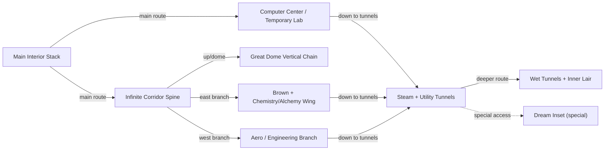
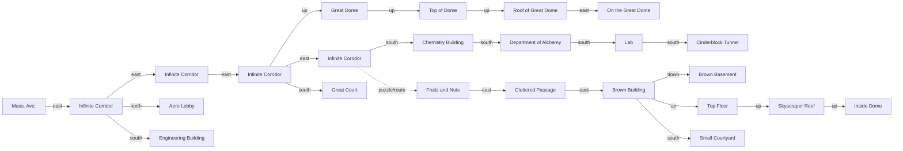
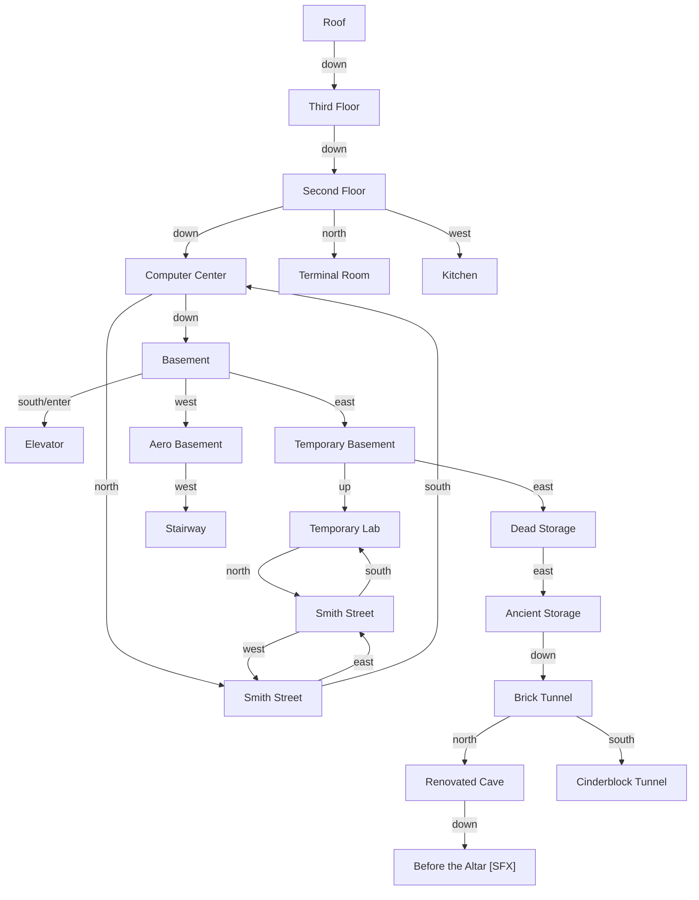
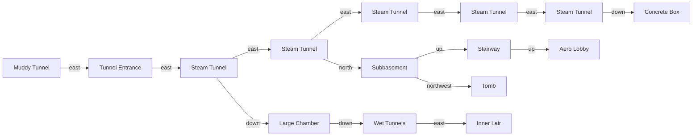
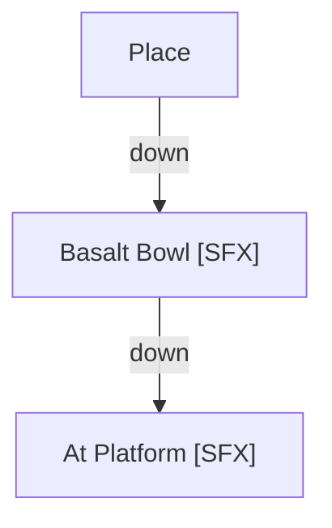
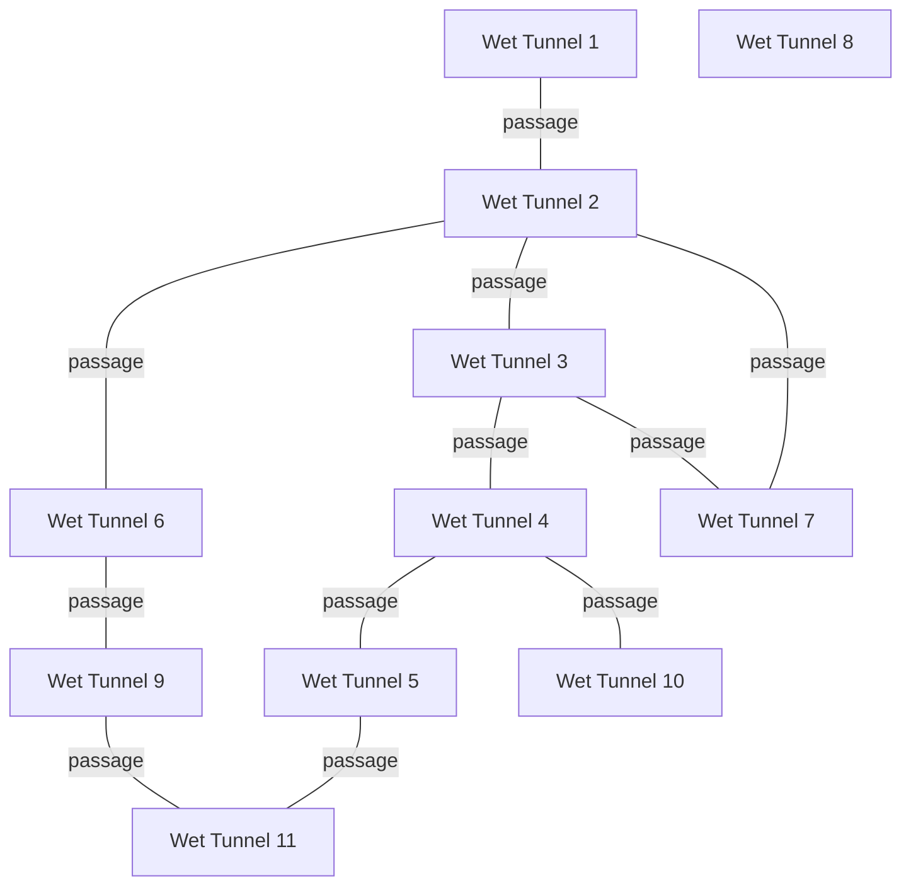

# The Lurking Horror Location Map

This document is the working reconciliation layer between the local game engine and the canonical boxed map.

## Prototype sync index

This document is also the quick-reference bridge between room-location documentation and the live prototype map pages.

Primary prototype pages:

- Integrated calibrated prototype (v1): [`../src/map-prototype.html`](../src/map-prototype.html)
- Building-first/isometric experiment track (v2): [`../src/map-prototype-2.html`](../src/map-prototype-2.html)

Synchronization status:

- Last synchronized against prototype content on: `2026-04-10`
- All known location IDs are rendered in prototype room labels as `[id]`
- Repeated room names are disambiguated in prototype labels:
  - `Infinite Corridor [W1..W5]`
  - `Steam Tunnel [S1..S5]`
  - `Wet Tunnel [Inset 1..11]` + `Wet Tunnel [Outer]`
  - `Smith Street [W]` and `Smith Street [E]`
- Puzzle/restricted paths use distinct line styles while retaining explicit direction labels.

Canonical map sources:

- [`../data/lurking.pdf`](../data/lurking.pdf) - boxed-map PDF
- [`../data/booklet-page3.png`](../data/booklet-page3.png) - upper/surface map page extracted from the booklet
- [`../data/booklet-page4.png`](../data/booklet-page4.png) - lower/underground map page extracted from the booklet

The PDF and booklet pages are the canonical presentation source. The Mermaid graph and notes here exist to make that material searchable, linkable, and checkable against the live engine.

## Discovery basis

- Rooms are currently identified as object-table entries parented under room root object `49`.
- The current room comes from `globals[0]` in the VM status snapshot.
- Direct movement validation was performed from the opening game state by replaying commands against serialized VM snapshots.
- Additional links were inferred from single-byte room exit properties once the direction/property mapping was validated.
- The boxed-map PDF and extracted booklet map pages are the canonical presentation/layout reference.
- Routine-driven exits and puzzle-only access paths are listed separately when they remain unresolved.

## Canonical section layout

The boxed map is clearly split into stable sections that should drive how we present and review the world:

- `booklet-page3.png` covers the upper campus/building layout:
  - Smith Street / Computer Center / Temporary Lab
  - the Infinite Corridor spine
  - the Great Dome vertical chain
  - the Brown Building / Skyscraper / Chemistry / Alchemy wing
- `booklet-page4.png` covers the lower and special-area layout:
  - the main interior stack from Terminal Room to Roof
  - the basement, storage, and steam-tunnel network
  - the Dream area (`Place`, `Basalt Bowl`, `At Platform`)
  - the Wet Tunnels inset and `Inner Lair`

## Reconciliation status against the boxed map

The current engine-derived room inventory lines up well with the boxed map's major named areas. The canonical map also clarified several presentation choices that were ambiguous in the raw generated graph:

- duplicated room names should be presented as canonical groups rather than as isolated object ids
- the world is better understood as page-level sections, not as one flat technical adjacency dump
- the Dream area is a distinct boxed subsection, not just three loose nodes
- the Wet Tunnels are a numbered inset on the boxed map and should eventually be reconciled to a player-facing numbering scheme rather than repeated generic `Wet Tunnel` labels
- the boxed map legend distinguishes one-way, puzzle-gated, restricted, and cross-section passages; the current Mermaid graph does not yet encode all of those distinctions cleanly

Known mismatches or still-open reconciliation points:

- the Mermaid graph still uses engine object ids to disambiguate repeated room names
- the numbered Wet Tunnels inset has not yet been fully mapped from booklet numbering to specific engine room ids
- several puzzle-only or routine-driven links are known from the booklet, but still need cleaner player-facing labels in this doc

## Spoiler policy

This document is intentionally a full technical/reference map, not a spoiler-safe player aid.

Decision for now:

- keep `docs/LOCATION_MAP.md` as the full internal/reference version
- leave hidden late-game areas and special-access routes visible here when they are known
- do not treat this document as the default in-game map experience
- handle any future spoiler-safe or progressive map as a separate artifact rather than weakening this reference doc

## Booklet-derived structure conclusions (for Task 45)

Using `../data/booklet-page3.png` and `../data/booklet-page4.png` as the primary visual source, the dynamic-map foundation should use:

### Vertical levels (university map)

For implementation, model the university as **6 practical vertical bands** (not exact meters, but stable map layers):

1. `L+2` high roofs and peak spaces  
   Examples: `Roof`, `On the Great Dome`, `Inside Dome`, `Skyscraper Roof`
2. `L+1` upper floors / upper dome shoulders  
   Examples: `Third Floor`, `Top Floor`, `Roof of Great Dome`, `Top of Dome`
3. `L0` main circulation level  
   Examples: `Second Floor`, `Computer Center`, `Infinite Corridor`, `Mass. Ave.`, `Brown Building`
4. `L-1` first underground/basement level  
   Examples: `Basement`, `Aero Basement`, `Temporary Basement`, `Brown Basement`
5. `L-2` deep utility/tunnel level  
   Examples: `Subbasement`, `Steam Tunnel` chain, `Muddy Tunnel`, `Large Chamber`, `Brick Tunnel`
6. `L-3` deepest inset/lair/wet-network level  
   Examples: numbered `Wet Tunnels` network and `Inner Lair`

Notes:
- The `Dream` inset (`Place`, `Basalt Bowl`, `At Platform`) is a special detached section and should not be treated as a normal university layer.
- Booklet layout is schematic; this banding is intentionally a gameplay/UI model, not a geometric reconstruction.

### Distinct area groups

For dynamic-map sectioning, treat these as separate area groups:

1. `Main Interior Stack` (Terminal Room -> Roof, plus Kitchen branch)
2. `Infinite Corridor Spine` (Mass. Ave. through corridor chain and Great Court)
3. `Great Dome Vertical Chain` (Great Dome through roof/dome-top spaces)
4. `Computer Center / Temporary Lab Complex` (including Temporary Basement and nearby storage links)
5. `Brown Building / Skyscraper / Chemistry-Alchemy Wing` (east branch and courtyard/basement ties)
6. `Aero / Engineering Branch` (Aero Lobby, Stairway, Subbasement, Engineering)
7. `Steam + Utility Tunnel Network` (Muddy/Tunnel Entrance/Steam segments/Concrete Box)
8. `Wet Tunnels + Inner Lair` (boxed numbered maze and lair tie-ins)
9. `Dream Inset` (special one-off area; exclude from normal progressive university map by default)

## Verified exit property mapping

- property `20` -> `exit`
- property `21` -> `enter`
- property `22` -> `down`
- property `23` -> `up`
- property `24` -> `northwest`
- property `25` -> `west`
- property `26` -> `southwest`
- property `27` -> `south`
- property `28` -> `southeast`
- property `29` -> `east`
- property `30` -> `northeast`
- property `31` -> `north`

## Sectioned map diagrams

The previous single giant graph has been split into section diagrams aligned to booklet pages and dynamic-map requirements.

### Why not UML arrows (`-left->`, `-right->`)?

Keep this document in Mermaid `flowchart` format for Markdown portability in this repo.  
Instead of UML directional arrows, use:

- `flowchart LR` / `flowchart TB` to force overall orientation
- section-level diagrams to reduce clutter
- explicit edge labels for special traversal actions

### A) Macro area connectivity (design-level)

### B) Upper campus/buildings (`booklet-page3.png`)

### C) Main interior + basement stack (`booklet-page4.png`)

### D) Utility underground (`booklet-page4.png`)

### E) Dream inset (`booklet-page4.png`, special)

### F) Wet tunnels inset (`booklet-page4.png`, abstracted)

## Canonical grouping crosswalk

This crosswalk records how the current engine-discovered rooms line up with the booklet map's visible sections.

### Upper campus and corridor page (`booklet-page3.png`)

- `Mass. Ave. (190)` -> left end of the Infinite Corridor chain
- `Infinite Corridor (218, 214, 210, 208, 206)` -> central horizontal spine
- `Aero Lobby (136)` -> branch above the west corridor
- `Engineering Building (38)` -> branch below the west corridor
- `Great Dome (249)`, `Top of Dome (213)`, `Roof of Great Dome (121)`, `On the Great Dome (145)` -> central vertical chain
- `Computer Center (65)` and `Temporary Lab (140)` -> upper-left pair beneath the two `Smith Street` rooms (`185`, `98`)
- `Fruits and Nuts (150)`, `Cluttered Passage (179)`, `Chemistry Building (248)`, `Department of Alchemy (174)`, `Lab (42)`, `Cinderblock Tunnel (17)` -> east/southeast branch
- `Brown Building (240)`, `Top Floor (195)`, `Inside Dome (109)`, `Skyscraper Roof (222)`, `Brown Basement (200)`, `Small Courtyard (16)` -> east-side Brown/Skyscraper branch

### Lower interior and underground page (`booklet-page4.png`)

- `Terminal Room (176)`, `Second Floor (137)`, `Third Floor (110)`, `Roof (127)` -> main vertical interior stack
- `Kitchen (33)` -> west branch from the upper interior stack
- `Computer Center (65)`, `Basement (27)`, `Temporary Basement (202)`, `Dead Storage (47)`, `Ancient Storage (171)` -> basement/storage chain
- `Aero Lobby (136)`, `Stairway (35)`, `Aero Basement (158)`, `Subbasement (142)`, `Tomb (9)` -> west basement branch
- `Muddy Tunnel (39)`, `Tunnel Entrance (34)`, `Steam Tunnel (66, 78, 138, 221, 227)`, `Concrete Box (37)` -> main tunnel chain
- `Renovated Cave (201)`, `Before the Altar (149)`, `Brick Tunnel (25)`, `Lab (42)`, `Cinderblock Tunnel (17)` -> east underground branch
- `Place (152)`, `Basalt Bowl (134)`, `At Platform (21)` -> Dream inset
- `Large Chamber (99)`, `Inner Lair (69)`, and the repeated `Wet Tunnel` rooms (`15`, `51`, `87`, `117`, `131`, `161`, `164`, `181`, `184`, `187`, `232`, `234`) -> Wet Tunnels section still awaiting numbered reconciliation

## Location inventory

### Inventory snapshot

- Total rooms in current engine inventory: `71`
- Reached from opening-state exploration: `21`
- Listed-only (not reached in opening sweep): `50`
- Full machine-readable registry (canonical for scripts): [`../tools/location-map-discovery.json`](../tools/location-map-discovery.json)

### Repeated-name families (important for UI disambiguation)

- `Wet Tunnel`: `15, 51, 87, 117, 131, 161, 164, 181, 184, 187, 232, 234`
- `Steam Tunnel`: `66, 78, 138, 221, 227`
- `Infinite Corridor`: `206, 208, 210, 214, 218`
- `Smith Street`: `98, 185`

### Opening-state discovered rooms

- `9` Tomb via `south -> down -> down -> west -> west -> down -> northwest`
- `27` Basement via `south -> down -> down`
- `33` Kitchen via `south -> west`
- `35` Stairway via `south -> down -> down -> west -> west`
- `38` Engineering Building via `south -> down -> down -> west -> west -> up -> south -> south`
- `47` Dead Storage via `south -> down -> down -> east -> east`
- `65` Computer Center via `south -> down`
- `98` Smith Street via `south -> down -> north -> east`
- `110` Third Floor via `south -> up`
- `127` Roof via `south -> up -> up`
- `136` Aero Lobby via `south -> down -> down -> west -> west -> up`
- `137` Second Floor via `south`
- `140` Temporary Lab via `south -> down -> north -> east -> south`
- `142` Subbasement via `south -> down -> down -> west -> west -> down`
- `158` Aero Basement via `south -> down -> down -> west`
- `176` Terminal Room
- `185` Smith Street via `south -> down -> north`
- `190` Mass. Ave. via `south -> down -> down -> west -> west -> up -> south -> west`
- `202` Temporary Basement via `south -> down -> down -> east`
- `214` Infinite Corridor via `south -> down -> down -> west -> west -> up -> south -> east`
- `218` Infinite Corridor via `south -> down -> down -> west -> west -> up -> south`

## Routine-driven transitions (categorized)

### Snapshot

- Total routine/custom exits tracked: `73`
- `Inferred reverse-links` (high confidence): `22`
- `Known conditional transitions` (understood behavior): `10`
- `Confirmed puzzle exits`: `7`
- `Truly unresolved` (likely puzzle/state-driven): `34`
- By property length: `len2=13`, `len3=45`, `len4=1`, `len5=13`

### Inferred reverse-links (high confidence)

Inference rule used here: if a routine-driven `exit` has exactly one standard incoming link to that room, treat `exit` as a high-confidence return to that linked room.

- `9` Tomb: `exit` (p20, len 3) -> `142` Subbasement
- `9` Tomb: `southeast` (p28, len 3) -> `142` Subbasement
- `47` Dead Storage: `east` (p29, len 3) -> `171` Ancient Storage
- `78` Steam Tunnel: `west` (p25, len 3) -> `66` Steam Tunnel
- `98` Smith Street: `east` (p29, len 2) -> `185` Smith Street
- `185` Smith Street: `west` (p25, len 2) -> `98` Smith Street
- `99` Large Chamber: `down` (p22, len 3) -> `187` Wet Tunnel
- `109` Inside Dome: `exit` (p20, len 3) -> `222` Skyscraper Roof
- `109` Inside Dome: `down` (p22, len 3) -> `222` Skyscraper Roof
- `138` Steam Tunnel: `west` (p25, len 3) -> `78` Steam Tunnel
- `142` Subbasement: `northwest` (p24, len 3) -> `9` Tomb
- `176` Terminal Room: `exit` (p20, len 3) -> `137` Second Floor
- `176` Terminal Room: `south` (p27, len 3) -> `137` Second Floor
- `195` Top Floor: `exit` (p20, len 5) -> `240` Brown Building
- `206` Infinite Corridor: `south` (p27, len 3) -> `248` Chemistry Building; `north` (p31, len 3) -> `150` Fruits and Nuts
- `208` Infinite Corridor: `east` (p29, len 3) -> `206` Infinite Corridor
- `210` Infinite Corridor: `east` (p29, len 3) -> `208` Infinite Corridor
- `214` Infinite Corridor: `east` (p29, len 3) -> `210` Infinite Corridor
- `218` Infinite Corridor: `east` (p29, len 3) -> `214` Infinite Corridor
- `221` Steam Tunnel: `west` (p25, len 3) -> `34` Tunnel Entrance
- `227` Steam Tunnel: `west` (p25, len 3) -> `221` Steam Tunnel

### Booklet verification status (pages 3/4 pass)

- Directly verified on booklet layout (named adjacency visible):
  - `Tomb <-> Subbasement` (`9`/`142`)
  - `Dead Storage <-> Ancient Storage` (`47`/`171`)
  - `Smith Street <-> Smith Street` (`98`/`185`)
  - `Inside Dome <-> Skyscraper Roof` (`109`/`222`)
  - `Terminal Room <-> Second Floor` (`176`/`137`)
  - `Top Floor <-> Brown Building` (`195`/`240`)
  - `Infinite Corridor <-> Chemistry Building` (`206`/`248`)
  - `Infinite Corridor <-> Fruits and Nuts` (`206`/`150`)
- Consistent with booklet, but room-id-specific confirmation is limited by repeated labels/inset numbering:
  - `Large Chamber down -> Wet Tunnel` (`99 -> 187`) matches the `Large Chamber -> Wet Tunnels` descent, but booklet uses numbered wet-tunnel nodes rather than engine ids.
  - Steam-tunnel chain inferences (`78 -> 66`, `138 -> 78`, `221 -> 34`, `227 -> 221`) are consistent with the linear Steam Tunnel sequence, but identical `Steam Tunnel` labels limit exact per-id validation from the booklet alone.
  - Infinite-corridor east-links (`208 -> 206`, `210 -> 208`, `214 -> 210`, `218 -> 214`) are consistent with the five-node corridor spine ordering, though booklet labels these nodes generically as `Infinite Corridor`.
- No inferred reverse-link currently contradicts the booklet maps.

### Known conditional transitions (understood behavior)

- Elevator group: both `enter` and `south` from `Third Floor (110)`, `Second Floor (137)`, `Computer Center (65)`, and `Basement (27)` move into `Elevator (124)` when the elevator is present and doors are open.
- Elevator reverse: `exit` and `north` from `Elevator (124)` return to the current floor's access room when doors are open; destination is floor-dependent, not a single static room id.
- These are condition-gated and intentionally not treated as static direct exits or reverse-link inferences.

### Confirmed puzzle exits

- `9` Tomb: `down` (p22, len 5)
- `17` Cinderblock Tunnel: `up` (p23, len 3)
- `25` Brick Tunnel: `up` (p23, len 3) -> `171` Ancient Storage; puzzle-gated initially, then unlocked for return travel after solve state changes.
- `47` Dead Storage: `enter` (p21, len 3)
- `66` Steam Tunnel: `west` (p25, len 3) -> `34` Tunnel Entrance (booklet-reconciled puzzle/restricted passage)
- `110` Third Floor: `north` (p31, len 2)
- `171` Ancient Storage: `down` (p22, len 3)

### Truly unresolved routine exits (likely puzzle/state-driven)

- `27` Basement: `down` (p22, len 3)
- `37` Concrete Box: `exit` (p20, len 3); `up` (p23, len 3); `north` (p31, len 4)
- `38` Engineering Building: `west` (p25, len 2); `south` (p27, len 2); `east` (p29, len 2)
- `42` Lab: `down` (p22, len 3); `north` (p31, len 3)
- `69` Inner Lair: `up` (p23, len 5)
- `121` Roof of Great Dome: `enter` (p21, len 5); `south` (p27, len 5)
- `138` Steam Tunnel: `south` (p27, len 3); `east` (p29, len 2)
- `174` Department of Alchemy: `south` (p27, len 3); `north` (p31, len 5)
- `180` Great Court: `north` (p31, len 2)
- `181` Wet Tunnel: `enter` (p21, len 5); `south` (p27, len 5)
- `195` Top Floor: `west` (p25, len 5)
- `208` Infinite Corridor: `south` (p27, len 2); `north` (p31, len 2)
- `210` Infinite Corridor: `exit` (p20, len 3); `south` (p27, len 3)
- `213` Top of Dome: `exit` (p20, len 5); `north` (p31, len 5)
- `214` Infinite Corridor: `south` (p27, len 2); `north` (p31, len 2)
- `222` Skyscraper Roof: `enter` (p21, len 3); `east` (p29, len 3)
- `227` Steam Tunnel: `up` (p23, len 5); `east` (p29, len 3)
- `248` Chemistry Building: `south` (p27, len 5)
- `249` Great Dome: `up` (p23, len 2)

## Notes

- This first pass is complete for the room inventory and for direct room-id exits decoded from the story data.
- The canonical references for reconciliation are [`../data/lurking.pdf`](../data/lurking.pdf), [`../data/booklet-page3.png`](../data/booklet-page3.png), and [`../data/booklet-page4.png`](../data/booklet-page4.png).
- Some special-access transitions are not yet tied back to a single player-facing action label. Those show up in the unresolved exit list above.
- The example special transition mentioned in task 25, reaching `Basalt Bowl`, remains a likely puzzle-driven access path that needs a later pass for a cleaner player-facing edge label.

